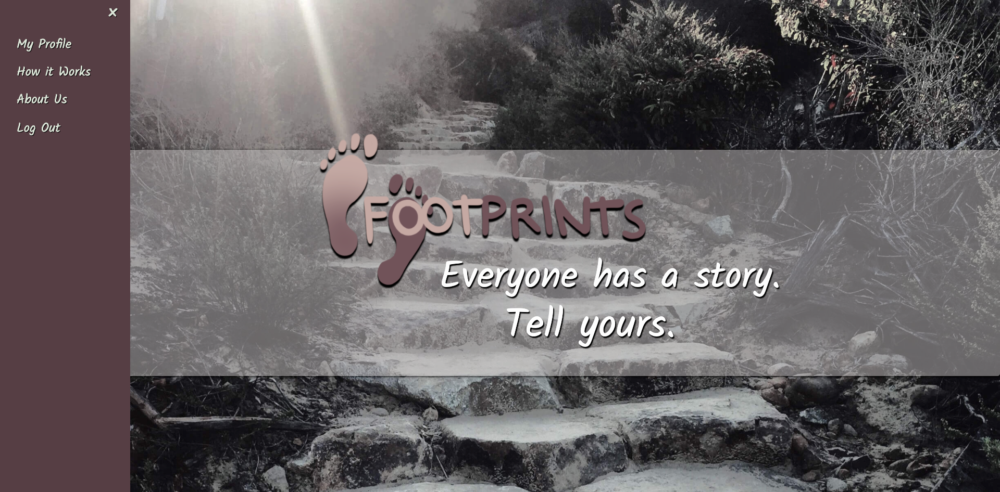
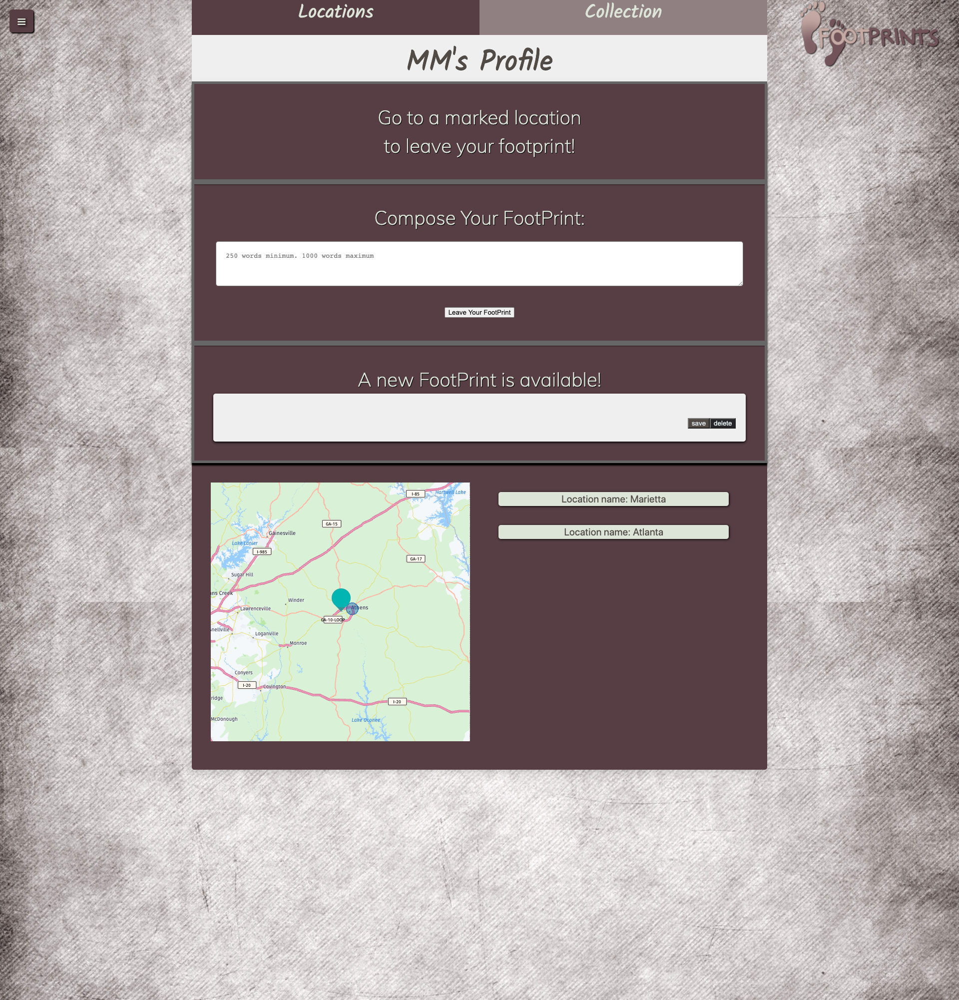

# footSteps

Even as the world around us is increasingly distant and divided, there are threads that keep us connected: our stories. Footsteps is a mobile first application leveraging a geo-location API to connect users to those who have gone before. When a user enters a specific area, they are presented with a story from another random user and may in turn leave their own to be discovered by the next visitor. 

---

## Description

As a human being searching for connection and context, I want to learn about the footsteps of those who came before me. When I am within a specific geographic area, I can access a library of diary entries between 200-1000 words left by previous visitors and leave my own story so that I become part of the broader community around me.

Footprints enables users to collect and leave stories known as footprints. These stories are tied to specific locations with the HERE API. Footprints is a bit anti-social network, a bit little-free-library, a bit geocaching, and a bit pokemon go. 

---

## Table of Contents

[Installation](#installation)  
 [Usage](#usage)  
 [License](#MIT_license)  
 [Contributing](#contributing)  
 [Contact](#contact)

---

## Installation

For local installation:

[Fork the repo from github](https://github.com/diegocordoba87/footSteps). Install npm dependencies and run seeds. Run npm start for localhost access.

---

## Usage

[Access the deployed app on heroku here](https://frozen-citadel-82754.herokuapp.com/)

A new user can create a profile, or returning users can log in. 

Once a user is logged in, they have access to their profile page, where notes they have created and found are stored. They can also see the map which centers on their current location and displays points of interest where new footprints can be found.

---

## MIT_License

    Copyright (c) [2020] [Andrea Hamilton, Diego Cordoba, Elizabeth Regas, Mark Mooney, Michael Nava]

    Permission is hereby granted, free of charge, to any person obtaining a copy
    of this software and associated documentation files (the "Software"), to deal
    in the Software without restriction, including without limitation the rights
    to use, copy, modify, merge, publish, distribute, sublicense, and/or sell
    copies of the Software, and to permit persons to whom the Software is
    furnished to do so, subject to the following conditions:

    The above copyright notice and this permission notice shall be included in all
    copies or substantial portions of the Software.

    THE SOFTWARE IS PROVIDED "AS IS", WITHOUT WARRANTY OF ANY KIND, EXPRESS OR
    IMPLIED, INCLUDING BUT NOT LIMITED TO THE WARRANTIES OF MERCHANTABILITY,
    FITNESS FOR A PARTICULAR PURPOSE AND NONINFRINGEMENT. IN NO EVENT SHALL THE
    AUTHORS OR COPYRIGHT HOLDERS BE LIABLE FOR ANY CLAIM, DAMAGES OR OTHER
    LIABILITY, WHETHER IN AN ACTION OF CONTRACT, TORT OR OTHERWISE, ARISING FROM,
    OUT OF OR IN CONNECTION WITH THE SOFTWARE OR THE USE OR OTHER DEALINGS IN THE
    SOFTWARE.

---

## Contributing

Fork the repo and suggest changes via github.

---

## Contact

[For Scott Griffin's github porfolio, click here.](https://github.com/scott-gr)

[To contact Scott, please email him at mscottgriffin@gmail.com.](mailto:mscottgriffin@gmail.com)

---

[For Mark Mooney's github porfolio, click here.](https://github.com/mjmoon15)

[To contact Mark, please email him at mjmoon15@gmail.com.](mailto:mjmoon15@gmail.com)

---

[For Elizabeth Regas' github porfolio, click here.](https://github.com/ElizaRegas)
  
 [To contact Elizabeth, please email her at elizaregas@gmail.com.](mailto:elizaregas@gmail.com)

---

© 2019 Trilogy Education Services, a 2U, Inc. brand. All Rights Reserved.
